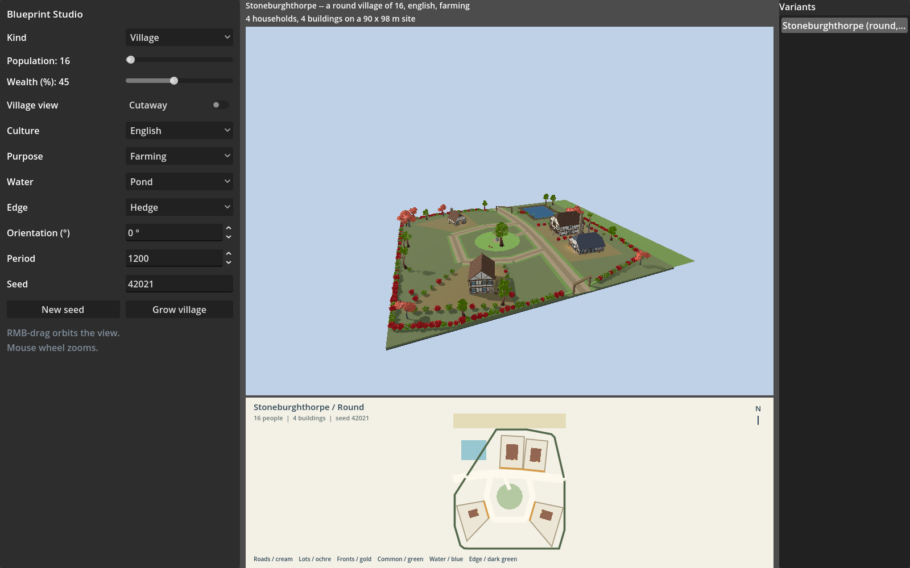
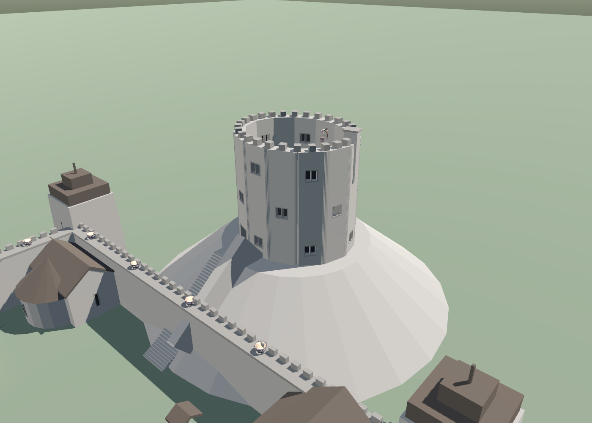

# BrickWild


**Deterministic procedural buildings and settlements for Godot 4.5.2.**

BrickWild turns a seed and a compact request into architecture with a plan:
churches, castles, furnished houses, shops, civic buildings, temples, landmark
hotels, world buildings, and complete villages. The same generated data can
produce an `ArrayMesh`, a furnished scene, placement metadata, a blueprint, or
a portable JSON document.



The project is written in GDScript. It has no C#, GDExtension, or runtime
package-manager dependency. Generation is seeded, measurements use metres, and
the public API keeps planning separate from mesh and scene creation.

## What BrickWild can make

- **Buildings with identity:** churches, castles, houses, shops, civic halls,
  grand hotels, temples, and regional world-building families.
- **Settlements, not scatter:** villages have roads, lots, a common, water,
  boundaries, vegetation, and buildings that face and fit their sites.
- **Planned interiors:** rooms, doors, stairs, furniture, and ritual routes.
  Castle checks measure occupied rooms and access against the emitted mesh;
  [interior coverage gaps remain](docs/CASTLE_INTERIORS.md#eligibility-and-remaining-work).
- **One source of truth:** plans and geometry drive meshes, blueprints,
  placement bounds, and serialized building documents.
- **A testable generator:** bounded QA lanes check structure, openings,
  circulation, furnishing, normals, massing, and deterministic output.



The castle above is generated geometry, not a hand-authored level. Its walls,
stairs, entrances, rooms, furniture, and access routes are all part of the
same seeded result. It is the Norman motte regression fixture, seed 8856.
The render tool requires it to pass physical QA before writing these images.
The 3 October capture checks eleven occupied structures and seven defensive
entrances connected to courtyard ground. See the [repair and test evidence](docs/MOTTE_ROUTE_REPAIR.md).
Other castle forms still have failing interior and opening checks.

## Try it

Start with the [installation guide](INSTALLATION.md). It covers both running
the Blueprint Studio from a source checkout and installing BrickWild into an
existing Godot project.

> [!IMPORTANT]
> BrickWild is preparing for its first public release. A fresh public clone
> can open the source project, but it does not yet contain three of the four
> prop packs required to build the complete addon or run asset-dependent QA.
> The exact limitation and current installation paths are documented in
> [Installation](INSTALLATION.md#current-public-preview-limit).

The tested engine version is **Godot 4.5.2**. Newer versions may work, but have
not yet been verified.

## Use it from GDScript

The public GDScript facade is `BrickWild`. Install the addon at
`res://addons/brick_wild`. Projects using the former `BigGlade` class or
`addons/big_glade` path must update those references.

```gdscript
var request := BuildingRequest.house(
	1234, &"townhouse", &"smith", 9.0, 12.0, 2.6, 2
)
var generated: GeneratedBuilding = BrickWild.generate(request)

if generated.is_ok():
	var placement: Dictionary = BrickWild.placement(generated)
	var building: Node3D = BrickWild.instantiate(generated, false, true)
	add_child(building)
```

Use `BrickWild.build_mesh(generated)` when you only need an `ArrayMesh`.
`BrickWild.generate_document(request)` produces a serializable building
document, and `BrickWild.describe_kind()` exposes the supported sizes, styles,
and purposes for data-driven tools.

House and shop styles share the house style catalogue. A caller can use the
published option ids directly; it does not need to import `HouseSpec`:

```gdscript
var styles: Array = BrickWild.describe_kind(&"house")["styles"]
var request := BuildingRequest.house(1234, &"pueblo", &"none")
```

Current vernacular options include `mediterranean`, `asian`, `thatch_cottage`,
and `pueblo`.

For close settlement displays, request a compact village through the same
public request boundary:
see [Compact Villages](docs/COMPACT_VILLAGES.md).

The facade currently supports these request kinds:

| Kind | Examples |
|---|---|
| `church` | Romanesque churches, Gothic cathedrals, domed landmarks |
| `castle` | Keeps, tower houses, motte-and-bailey and concentric castles |
| `house` | Multi-storey homes with room plans, trades, furniture, and yards |
| `shop` | Blacksmiths, inns, bakeries, guildhalls, and civic buildings |
| `hotel` | A furnished, three-storey landmark hotel |
| `temple` | Axial ritual buildings with form and cult variants |
| `world` | Regional and functional building families |
| `village` | Planned settlements containing roads, lots, buildings, and landscape |

## How it is built

```text
request + seed
      -> family plan/spec
      -> measured geometry
      -> mesh or furnished scene
      -> placement, blueprint, and portable document
```

Every family owns its vocabulary and planning rules. Shared mesh emitters and
assemblers turn those decisions into geometry and scenes. QA reads both the
plan and the emitted result, which lets it catch defects that a screenshot
alone cannot.

## Documentation

- [Install BrickWild](INSTALLATION.md)
- [Development setup and test workflow](DEVELOPMENT.md)
- [Contributing](CONTRIBUTING.md)
- [Public API transport and JSON contract](docs/PUBLIC_API_TRANSPORT.md)
- [Village generation](docs/VILLAGES.md)
- [Building and landmark references](docs/LANDMARKS.md)
- [Known issues](docs/KNOWN_ISSUES.md)
- [Changelog](CHANGELOG.md)

## Project status

BrickWild is under active development and has not published a stable release
yet. `BrickWild.API_VERSION` is currently `2`, but seeded output is only stable
within a generator release: generator improvements may deliberately change the
building produced by a seed. Save a `BuildingDocument` when an exact generated
building must remain fixed.

See [Contributing](CONTRIBUTING.md) before opening a pull request. Bug reports
should include the building kind, seed, dimensions, Godot version, and the
smallest reproduction available.

## License

BrickWild's original code is licensed under the
[Apache License 2.0](LICENSE). Third-party models and other assets retain their
own licenses. Review the license and README beside each pack under
`assets/props/` before redistributing an asset-bearing build.
