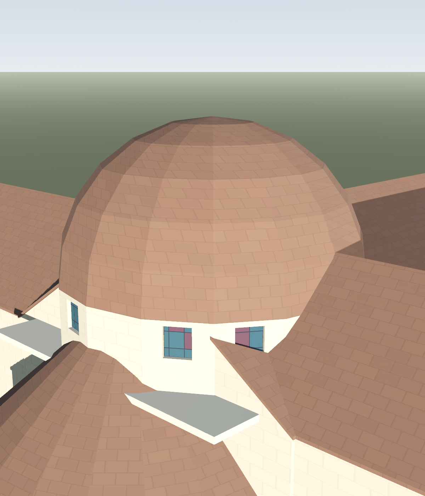
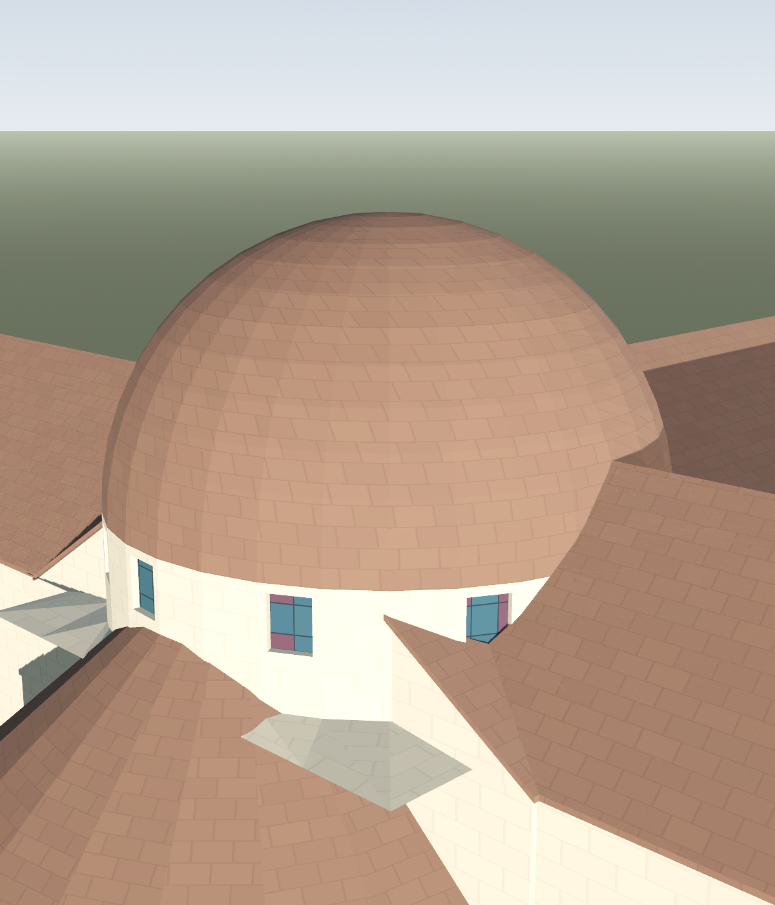
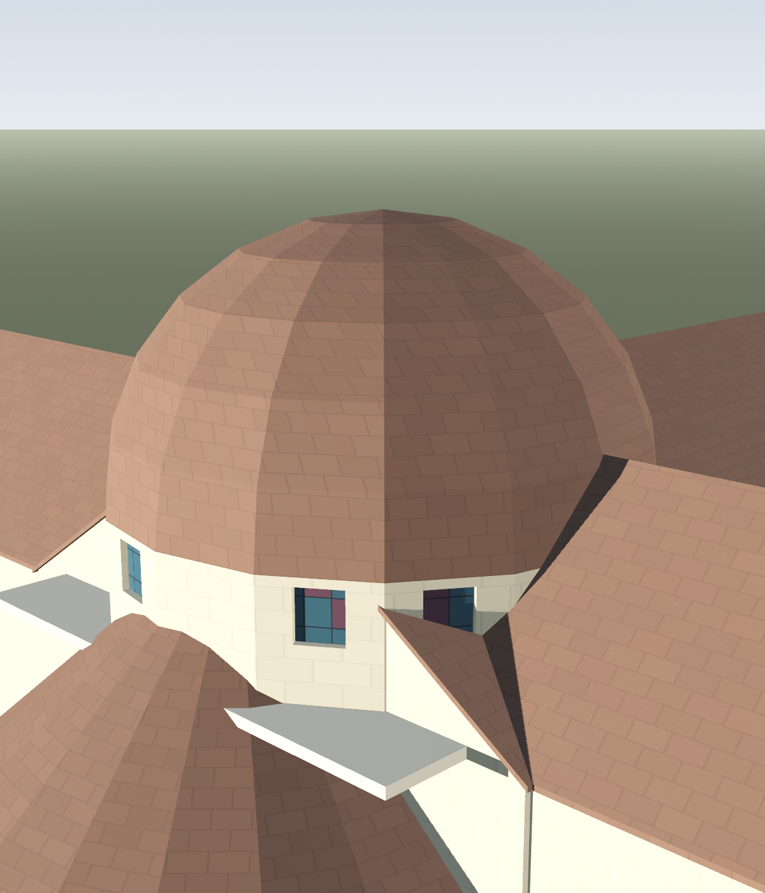
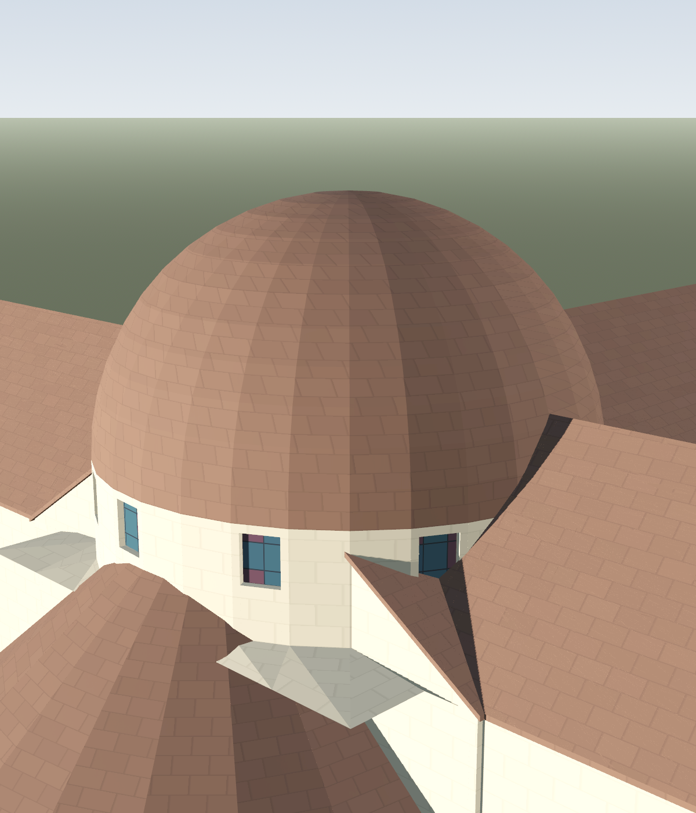
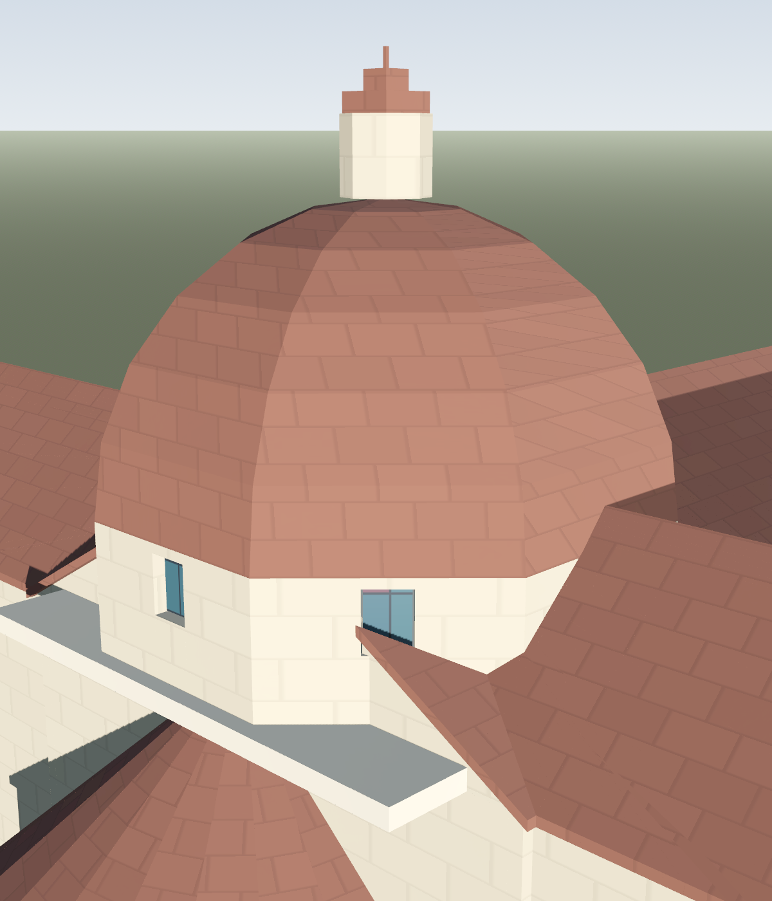
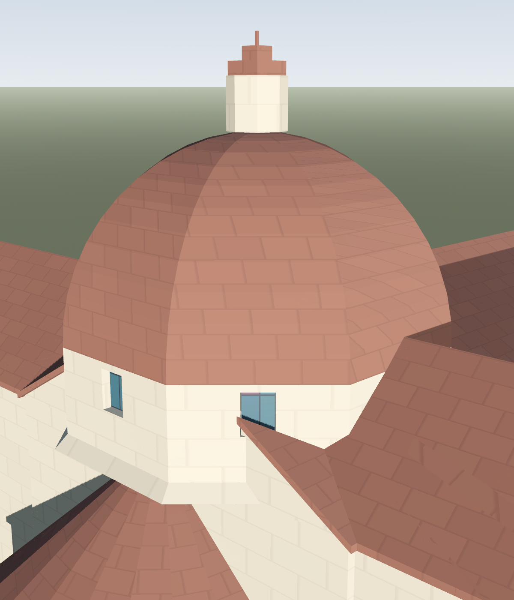
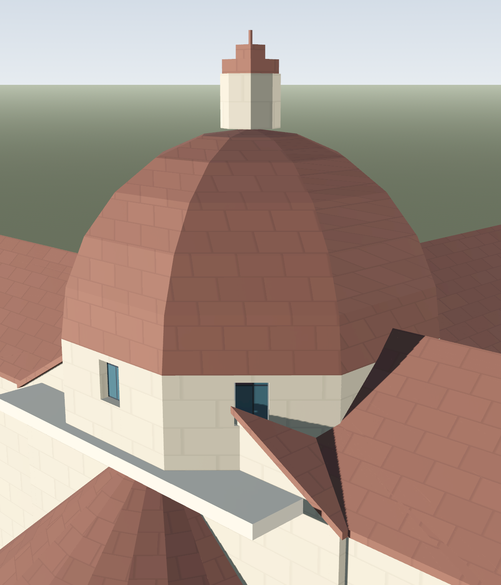
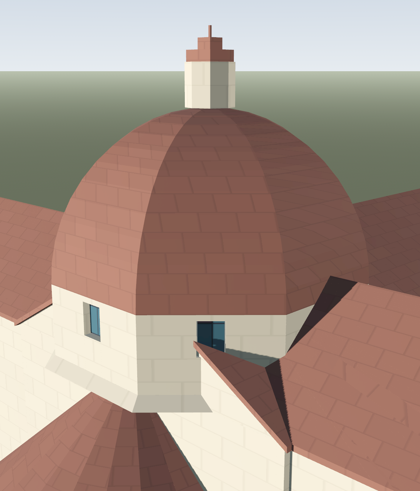

# VIS-008: hero church dome support and shell

## Change

- Replaced the broad square pendentive trim block with a closed loft from the square crossing perimeter to the drum ring. The loft uses the drum's count and phase, with outward facet normals, a continuous square bearing edge, and matching top ring.
- Hagia Sophia's hemispherical hero drum and shell use 32 radial sides and a refined vertical profile. Florence remains an explicit eight-sided drum and shell; only its vertical profile is refined.
- Secondary half-domes, exedrae, and non-hero domes retain their previous segment/profile counts. No MeshKit or ChurchRoofs default changed.
- Added focused fixtures for hero shell segmentation, the closed support loft, outward shell and cap normals, per-vertex UVs, and dome end-cap UVs/normals.

## Fixed-camera render pairs

Both builds use deterministic seeds, one target per landmark, one front light, and one raking light. The before images come from clean base `eb15450`; the after images come from this worktree. The renderer is [render_church_dome_acceptance.gd](../../tools/render_church_dome_acceptance.gd).

| Landmark | Before front | After front | Before raking | After raking |
|---|---|---|---|---|
| Hagia Sophia |  |  |  |  |
| Florence |  |  |  |  |

### Visual review

- Hagia's shell reads rounder: the former broad facets are smaller and the profile is smoother. In the raking frame, sloped facets bridge the square support into a continuous drum bearing ring. No open corner crack is visible. Nearby transept roofs obscure portions of the support's lower edge, so this is a schematic massing view rather than an unobstructed support study.
- Florence retains its eight principal sides. Its vertical curve is less stepped while the octagonal silhouette remains visible.
- The before/after pairs use the same camera target and light angles. The roofs around the crossing still intersect the lower support area in both versions.

## Verification

- `dome_fixture_final.log`: support and shell fixture PASS, 20 checked, 0 failures.
- `roof_seams_final.log`: roof seams and dome caps PASS, 49 checked, 0 failures, 0 warnings. Includes end-cap per-vertex outward-normal and finite-UV assertions.
- `churchroof_final.log`: church roofs PASS, 5,325 checked, 0 failures, 0 warnings. This also retains the existing dome mass and roof-ray checks.
- `lane_church.log`: lane:church was stopped at the agreed 12-minute wall cap while still CPU-active. The log had only reached `Running church...`; no suite summary was produced, so the lane is incomplete.
- `render_after.log`: non-headless renderer completed all four after frames.

An earlier broad tessellation experiment was discarded. It increased secondary dome counts and produced roof seam duplicates, plus failures in the existing roof-ray fixture. The trial logs are under [trials](trials/); after narrowing the change to the hero domes and restoring secondary counts, the final focused roof and seam suites passed.

## Limits

The support is a faceted, tapered geometric transition. It is not a historically detailed pendentive surface. Roof intersections partly conceal its lower bearing line in the full landmark views. The isolated mesh fixture covers the whole support perimeter and matched top ring.
