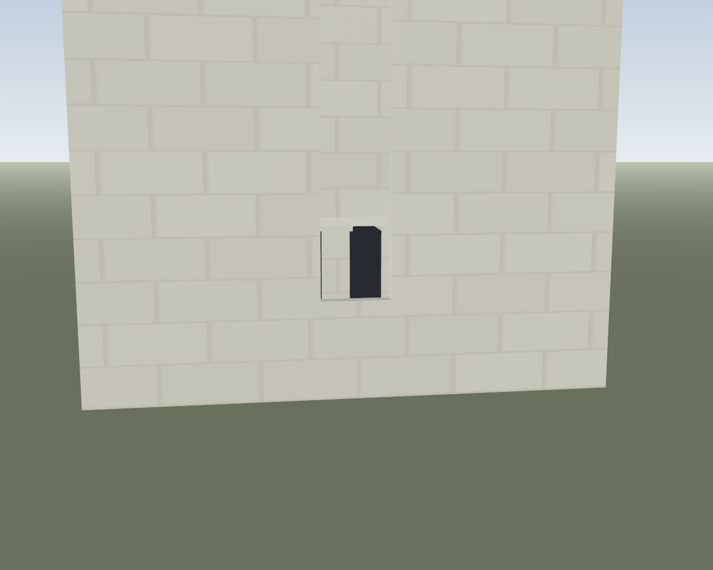
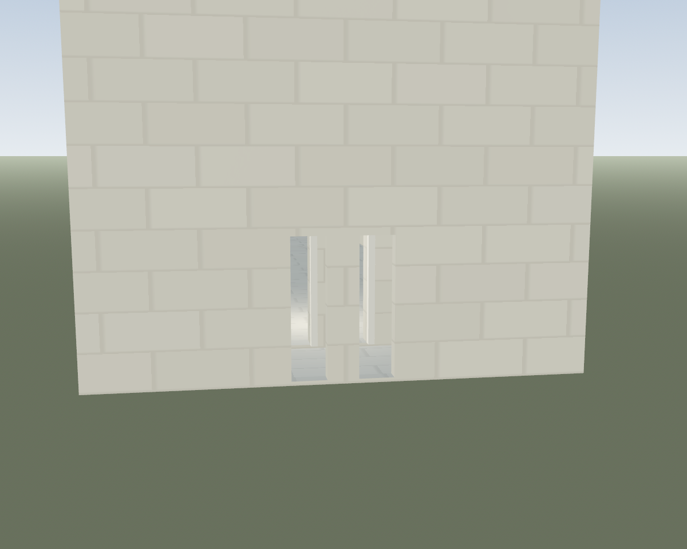
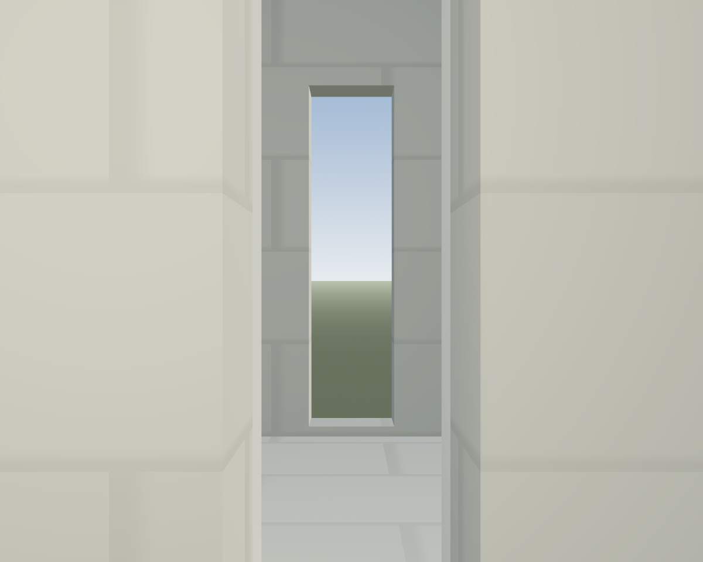
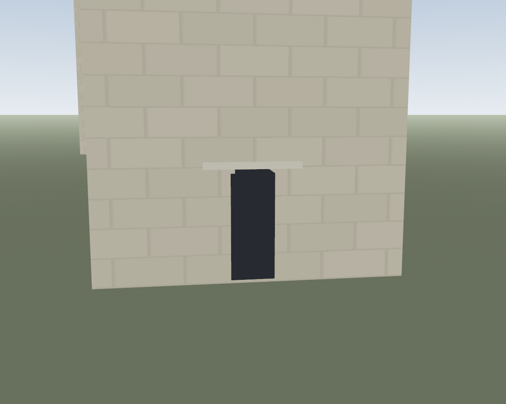
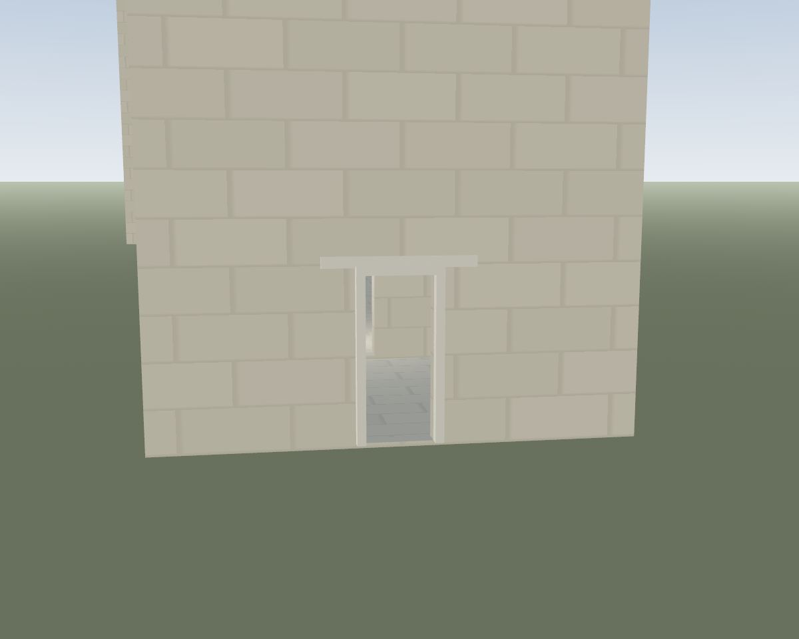
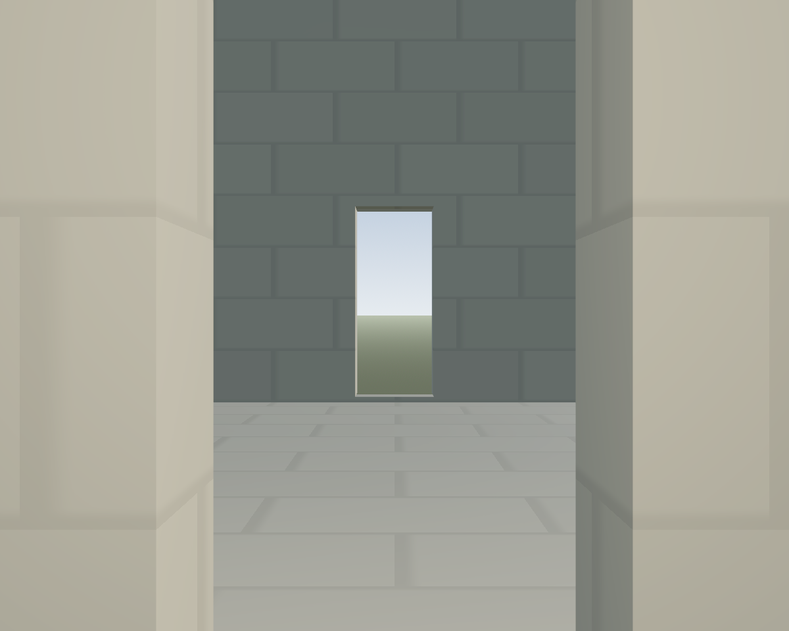

# VIS-014: church west entrance routes

The narthex and single axial tower originally showed west doors while at least
one wall behind each door remained solid. The narthex outer opening also began
over two metres above the floor. A ray from the approach toward the nave hit
the uncut nave front wall at `z = -31.0` in the fixed 62 m fixtures.

The builder now cuts the same door intervals through the nave front, both
faces of the single tower, and both faces of the narthex when present. The
narthex outer door takes the plan's west door position and height, keeping
its threshold at floor level. Twin doors remain twin through each layer.
The single tower and narthex combination is covered as well. The main door
log says `through` only with this complete route; the narthex outer face has
its own through log. Jamb and lintel trim sits outside the tested throat.

## Fixed-camera evidence

Each pair uses the same seed, material, camera and light before and after.
The views isolate the entrance; they do not claim a full church silhouette
improvement.

| Fixture | Before | After |
|---|---|---|
| Narthex front |  |  |
| Narthex inside |  |  |
| Tower front |  |  |
| Tower inside |  |  |

The [raking narthex](after/narthex_raking.png) and
[raking tower](after/tower_raking.png) views show the cut returns.

## Verification

The [route fixture](route_fixture.log) checks 20 conditions across narthex,
single tower and their combination: full exterior-to-nave stone and
all-surface rays, adjacent piers, log truth and a ground-level narthex door.
It passes with no failures or warnings. The [focused suite log](focused_final.log)
passes 204 church aperture and 726 load-path checks, 930 total, without
failures or warnings. The aperture portion took 499.66 seconds on this busy
host. The [three entrance normal fixtures](normals_fixture.log) pass the mesh
winding and opening-facing checks with no failures or warnings. The broader
`normals massing` run remained CPU-active in its first suite for over nine
minutes and was stopped without a result; its [partial log](normals_massing.log)
is not a pass. `QA-PERF-002` tracks a bounded church change lane.
