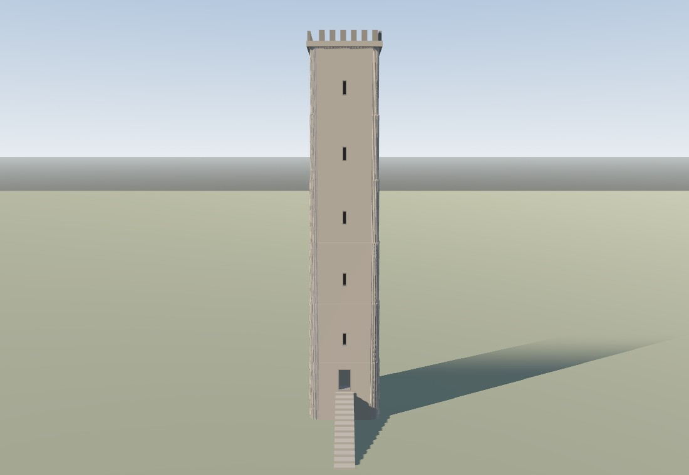
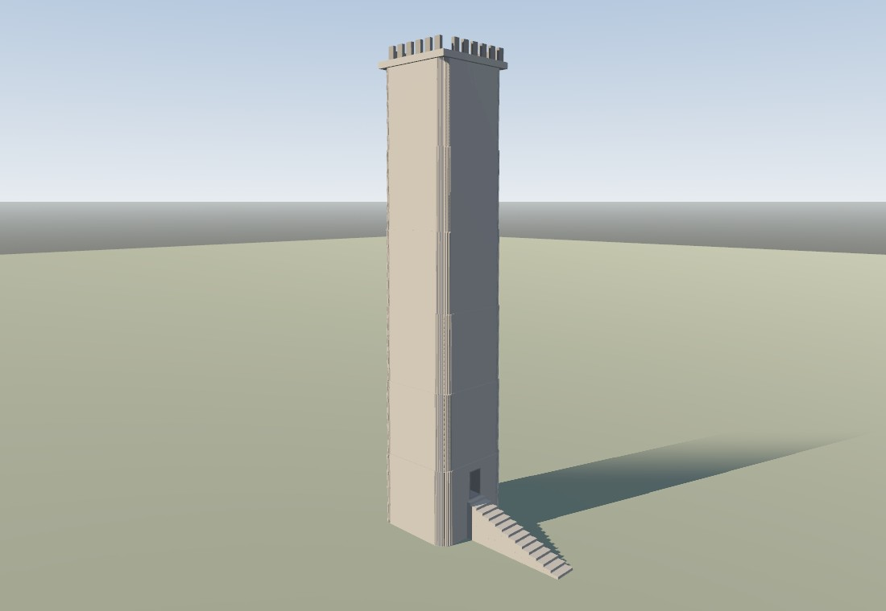

# CAS-REG-003: tower-house openings

## Finding and repair

Seed 8803 generated a Bologna tower house with a slit window width of 0.32 m.
`CastleTowerPlan._add_windows` rejected widths below 0.35 m, so the plan had no
windows on any occupied floor. The same cause affected Scottish tower-house
seed 8804. The plan now accepts widths from 0.30 m. Its window positions still
derive from the tower storeys' true wall edges.

The raised entrance already came from the actual tower plan and was emitted on
the tower wall face. Its part record used `opening_kind="door"` and
`tag="tower_house"`; `TowerCheck` only recognized the older `kind="window",
tag="door"` record. The check now accepts explicit door/window opening kinds
and keeps the legacy fallback.

The fixture asserts one raised planned entrance, exact planned-to-emitted
window count, one emitted window in every occupied floor band, normal and
opening integrity, and passing facade checks. It also removes the planned
windows and door in turn to verify that the respective checks reject each
missing feature.

## Evidence

- `ctowerplan`: 990 checks passed.
- `ctowerhouse`: 26 checks passed across Bologna 8803 and Scottish 8804. It
  includes `NormalsSuite.check_mesh` and `NormalsSuite.check_openings` on each
  production builder output.
- The baseline `castle-change` lane failed Scottish 8804 with no planned
  window surface and five occupied storeys without emitted windows. Detailed
  pre-fix plan/build measurements are in
  [repro_dims.log](../artifacts/cas_reg_003/repro_dims.log) and
  [repro_details.log](../artifacts/cas_reg_003/repro_details.log).
- Full focused suite logs: [ctowerplan.log](../artifacts/cas_reg_003/ctowerplan.log)
  and [ctowerhouse_rerun.log](../artifacts/cas_reg_003/ctowerhouse_rerun.log).
- Fixed-camera renders use the same seed, target, framing radius, yaw, pitch,
  and lighting on baseline `57f349c` and repaired worktree. The entrance and
  exterior stair are visible in both; five occupied-storey slit windows are
  visible after the repair.

| Camera | Baseline | Repaired |
|---|---|---|
| Front |  |  |
| Raking |  |  |

The render commands and output are recorded in
[render_before.log](../artifacts/cas_reg_003/render_before.log) and
[render_after.log](../artifacts/cas_reg_003/render_after.log). The artifact
README distinguishes these appearance references from the geometry-backed
plan and emission checks.

## Scope limits

This closes the tower-house slit-width and TowerCheck record-contract defects
for the fixed fixtures. Root also reproduced separate gate/keep access failures
on Crusader seeds 9118 and 9250, and interior opening placement failures on
Bavarian ridge seed 8805. Those are outside this change. Broad castle and voxel
sweeps were not run here; the focused tower checks passed.
